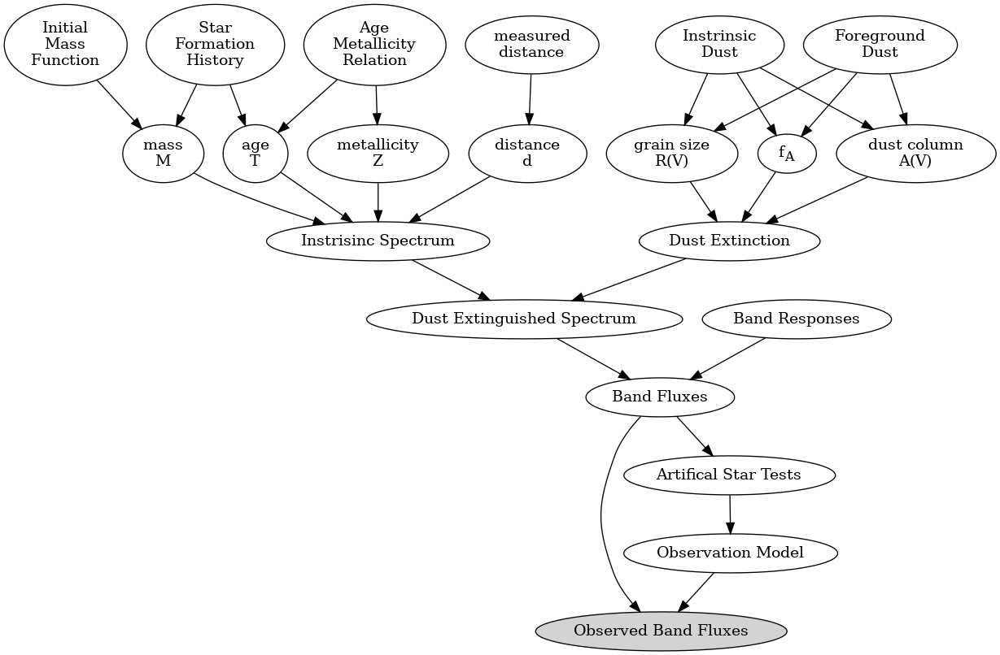
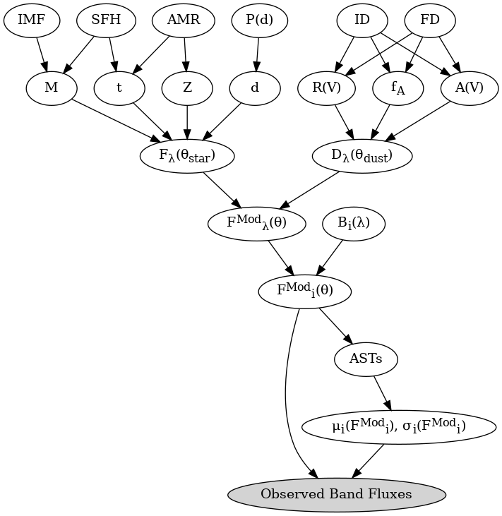

###############
Graphical Model
###############

A graphical model is useful to visualize how the BEAST is structured and works.
See Gordon et al. (2016, ApJ, 826, 104, <http://adsabs.harvard.edu/abs/2016ApJ...826..104G>)
for more details on the BEAST.

Text version
============

Generated with the `beast plot_graphic_model --type=text --savefig=png`.

Math version
============

Based on equations in Gordon et al. (2016).

Generated with the `beast plot_graphic_model --type=math --savefig=png`.
