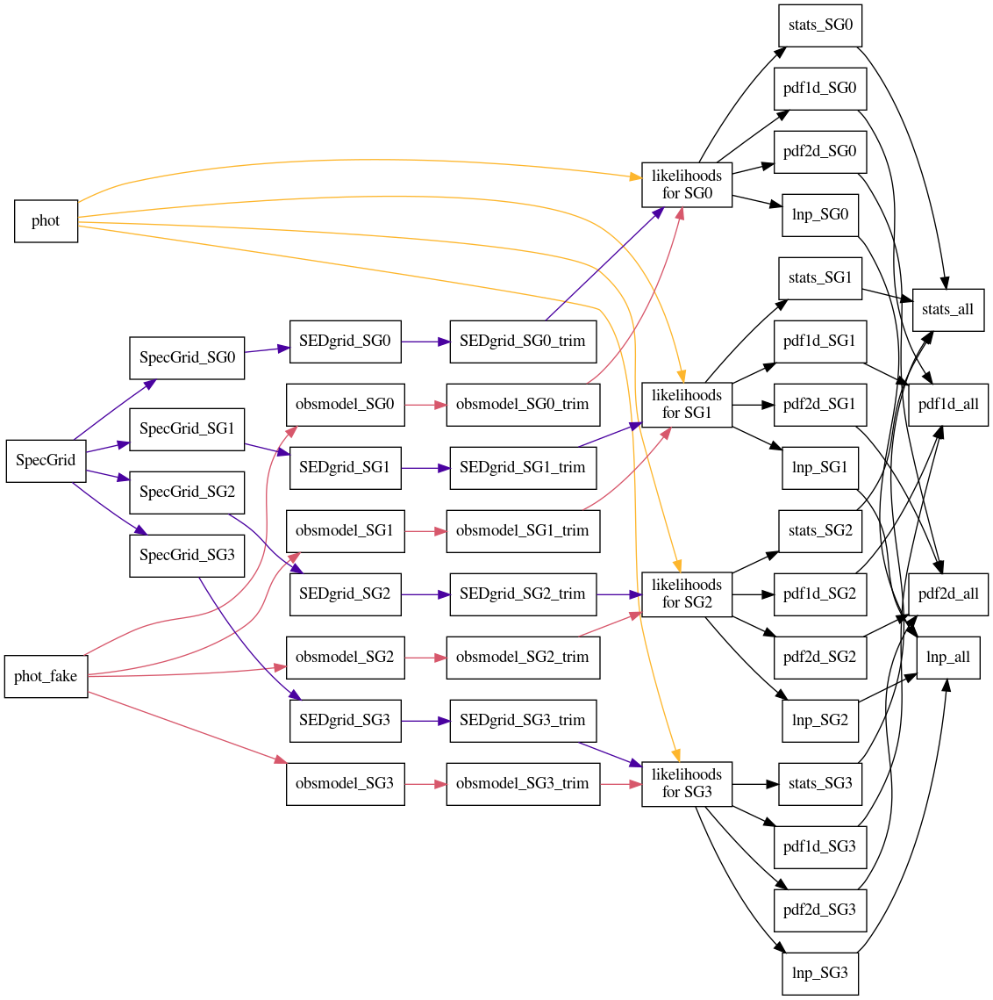

.. _beast_graphical_model:

###############
Graphical Model
###############

A graphical model is useful to visualize how the BEAST is structured and works.
See Gordon et al. (2016, ApJ, 826, 104, <http://adsabs.harvard.edu/abs/2016ApJ...826..104G>)
for more details on the BEAST.

Text version
============

.. image:: images/beast-graphic-text.png

Generated with the `beast plot_graphic_model --type=text --savefig=png`.

Math version
============

Based on equations in Gordon et al. (2016).

.. image:: images/beast-graphic-math.png

Generated with the `beast plot_graphic_model --type=math --savefig=png`.

###############################
Graphical Model of Output Files
###############################

This visualizes how BEAST runs create files when using either (a) subgrids or
(b) source density (SD) splitting.  To visualize the use of both, replace each
SED subgrid branch with an instance of the SD file tree.

Subgrids
========

Generated with `beast plot_graphic_file_flow --plot_type=subgrid --savefig=png`.

Source Density
==============

.. image:: images/beast-graphic-file-flow-sd.png

Generated with `beast plot_graphic_file_flow --plot_type=sd --savefig=png`.
