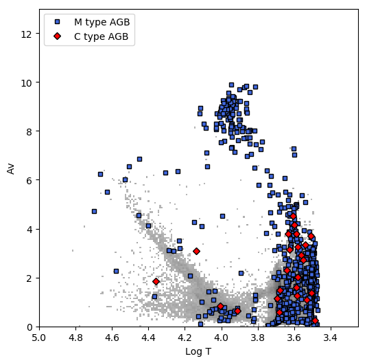
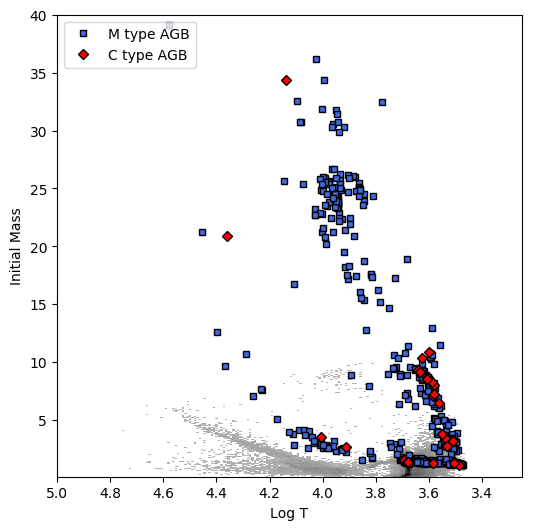

############
Known Issues
############

Star Types not Included in Stellar Models
=========================================

The BEAST includes several different stellar libraries and isochrones
to cover as much of the H-R diagram as possible. Stellar types that
are not included in these libraries will be poorly fit, sometimes
outputting nonsensical stellar parameters.

Asymptotic Giant Branch (AGB) Stars
-----------------------------------

The BEAST does not yet include stellar libraries that include
thermally-pulsing (TP-)AGB stars. TP-AGB stars often have a large
amount of circumstellar dust, causing significant extinction at
shorter wavelengths. The BEAST currently identifies many of these
objects as very luminous, massive stars with a unrealistic amount of
interstellar extinction. Future BEAST versions will include AGB
libraries.

The images below show BEAST results for a test dataset with known M
type and C type AGB stars. If the AGB stars were correctly fit, they
would have cooler effective temperatures (log T = 3.4 - 3.6) and lower
initial masses (<8 M_sun).

	

	
