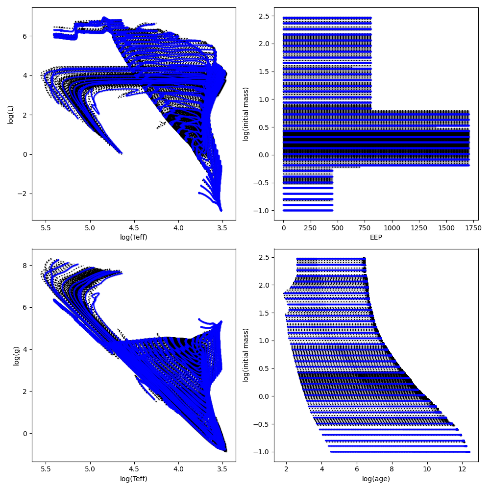
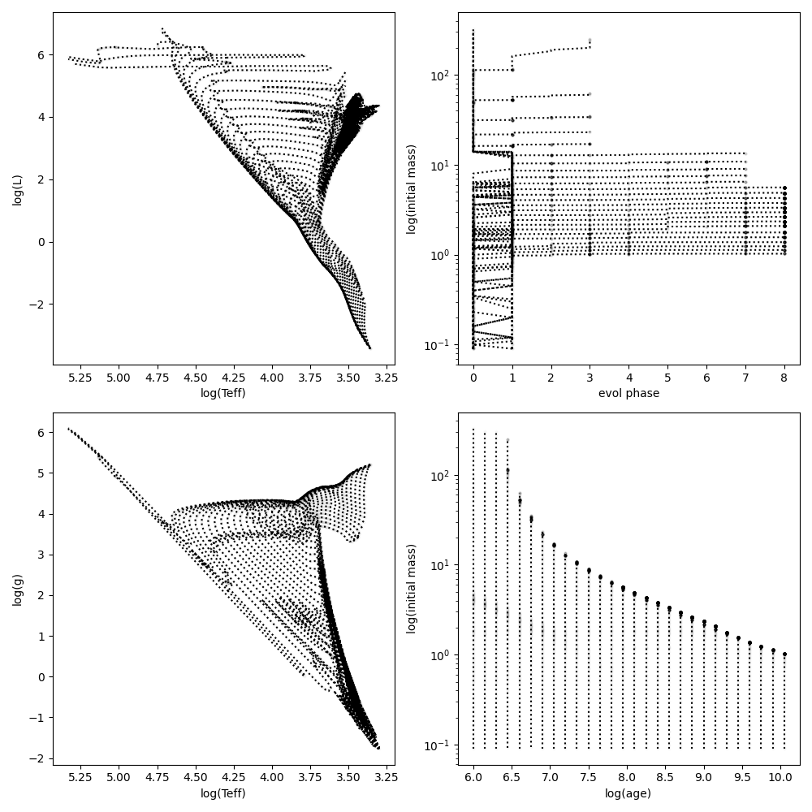

#################
Stellar Evolution
#################

The BEAST physics model uses a model of stellar evolution as a function
of stellar initial mass, age, and metallicity.  This model gives the 
necessary Teff, log(g), and metallicity needed to determine the correct
stellar atmosphere model to use for each evolutionary point.

The stellar evolution can be provide as evolutionary tracks or isochrones.

Evolutionary Tracks
===================

Evolutionary Tracks are calculated using stellar interior models and give
the stellar properties as a function of the age as the star goes through
its evolution.  The tracks are given for constant initial mass and have 
variable age spacing.  The variable age spacing is needed as the different 
evolutionary phases of a star have large differences in absolute age.  A 
100 solar mass stars evolves much, much faster than a 1 solar mass star.

Different views of example MIST evolutionary tracks are shown.  The black
gives the as provided MIST tracks and the blue gives the interpolated to 
a uniform mass spacing of log(mass) = 0.1.

Isochrones
==========

Isochrones are derived from evolutionary tracks and give the stellar 
properties as a function of constant age for different masses.  Since
stars of different masses have different lifetimes, the mass spacing in
an isochrone is variable with age.

Different views of example Padova isochrones is shown.  The isochrones
were downloaded from the CMD website.

	