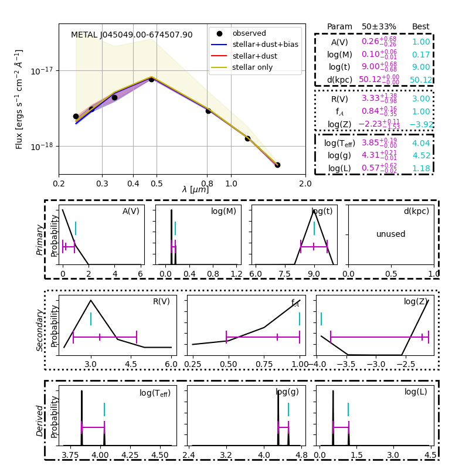

###############
Running Example
###############

You can find examples of BEAST runs in the
`beast-examples repository <https://github.com/BEAST-Fitting/beast-examples>`_
There are a number of different examples for different uses.  Some are included
for historical purposes (e.g., `phat_small` was used for testing for early
BEAST versions) and generally should not be used.  The main example that is
maintained and will work with the latest BEAST code is `metal_small`.

metal_small Example
-------------------

Reminder: This example is in the beast-examples repository in the metal-small
subdirectory, see above.

This example is based on a small amount of METAL program data.
METAL is an HST program (PI: J. Roman-Duval) that included parallel imaging
of regions in the Large Magellanic Cloud.

Next, bring up the BEAST help message, which describes the available switch
options, with

.. code-block:: console

    $ ./run_beast.py -h

You should be presented with the following options::

  -h, --help              show this help message and exit
  -p, --physicsmodel      Generate the model grid
  -o, --observationmodel  Calculate the noise model
  -t, --trim              Trim the model and noise grids
  -f, --fit               Fit the observed data
  -r, --resume            Resume a run

Now launch a sample BEAST run (with flags set to run through the full
sequence of generation of physics model, observation model generation, trimming
of the grid, and fitting to the observed data) using

.. code-block:: console

  $ ./run_beast.py -potf

If the BEAST is running correctly, this command should run without errors
and should have written the output files into 'beast_example_phat/'. The result
can be plotted using

.. code-block:: console

    $ beast plot_indiv_fit beast_metal_small/beast_metal_small --starnum=1

The argument for this script is the prefix of the output files. The output
should look like this

