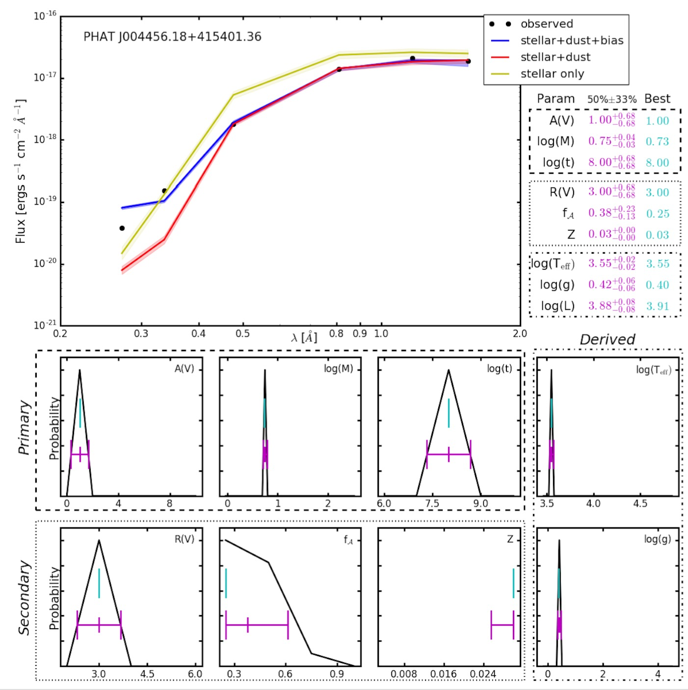

############
Installation
############

Requirements
============

Running the BEAST requires:

- Python >=3.4 (recommended) or 2.7 (still possible)
- Astropy >=1.3

In turn, Astropy depends on
`other packages <http://docs.astropy.org/en/latest/install.html>`_ for
optional features. From these you will need:

- `hdf5 <http://h5py.org/>`_ to read/write `Table` objects from/to HDF5 files.

You will also need:

- `PyTables <http://www.pytables.org/>`_ to manage large amounts of data.

One easy way to obtain the above is through the AstroConda Python stack:

- First install `Miniconda <https://conda.io/miniconda.html>`_ which
  contains the conda package manager. Once Miniconda is installed,
  you can use the `conda` command to install any other packages and create
  environments, etc.

- Setup the AstroConda Channel::

    $ conda config --add channels http://ssb.stsci.edu/astroconda

- Install AstroConda with Python 3 (recommended)::

    $conda create -n astroconda stsci

- Install AstroConda with Python 2.7 (still possible)::

    $ conda create -n iraf27 python=2.7 stsci pyraf iraf

- Make sure that the ``PyTables`` and ``hdf5`` packages are installed:

    $ conda install -n astroconda (or iraf27) pytables
    $ conda install -n astroconda (or iraf27) hdf5

Installing the BEAST
====================

In addition to installing the code, library files also need to be installed.
See :ref:`library-files`.

Using pip
---------

``beast`` can also be installed using pip::

    # from PyPI
    $ pip install beast

    # if you already have an older version installed
    $ pip install --upgrade beast

    # from the master trunk on the repository, considered developmental code
    $ pip install git+https://github.com/BEAST-Fitting/beast.git

From source
-----------

``beast`` can be installed from the source code in the normal
python fashion after downloading it from the git repo::

     $ python setup.py install

For developers
--------------

This option is suitable if you *plan to make code contributions* to the BEAST.
See the :ref:`beast_development` for details.

.. _library-files:

BEAST Library Files
===================

For the BEAST to work properly, you need to place a set of files in a
directory.  These files contain information related to filters,
stellar atmospheres, and in the future stellar evolution models.

.. _library_loc:

Location
--------

There are 3 possible locations for these files (in the order the code
will search for them):

1. in a directory designated by the BEAST_LIBS environment variable
2. in the '.beast' directory in the home directory of the current user
3. in the source code in 'beast/beast/libs'

Whichever of the options used, the directory needs to be manually created.

Manual download
---------------

<https://stsci.box.com/v/beastlibs>

Script download
---------------

After installing the `beast`, run the following script and the library files
will be downloaded into the location specified in :ref:`library_loc`::

     $ python -m beast.tools.get_libfiles

Running Example
===============

You can find examples of BEAST runs in the
<https://github.com/BEAST-Fitting/beast-examples>
repository.

Inside each example, there is a run_beast*.py script.

phat_small example
------------------

This example is based on a *very* small amount of PHAT old data.

If the beast has not been installed (only downloaded from github), then
In the 'phat_small' directory, place a soft link named 'beast' to where the
beast code is located.  Specifically::

    $ cd beast-examples/phat_small

    $ ln -s beast_code_loc/beast/beast beast

If you installed Python through AstroConda, first activate the correct
AstroConda environment::

    $ source activate astroconda

Verify that the current default Python is version 3::

    $ python --version

Now try a sample BEAST run::

    $ ./run_beast.py

or::

    $ python run_beast.py::

Optionally, you can run BEAST with one, or a combination, of these arguments

  -h, --help              show this help message and exit
  -p, --physicsmodel      Generate the model grid
  -o, --observationmodel  Calculate the noise model
  -t, --trim              Trim the model and noise grids
  -f, --fit               Fit the observed data
  -r, --resume            Resume a run

For example: ``$ ./run_beast.py -h`` or ``$ ./run_beast.py -potf``

If the BEAST is running correctly the second command should run without errors
and should have written the output files into 'beast_example_phat/'. The result
can be plotted using::

    $ python beast/plotting/plot_indiv_fit.py beast_example_phat/beast_example_phat

The argument for this script is the prefix of the output files. The output
should look like this:

