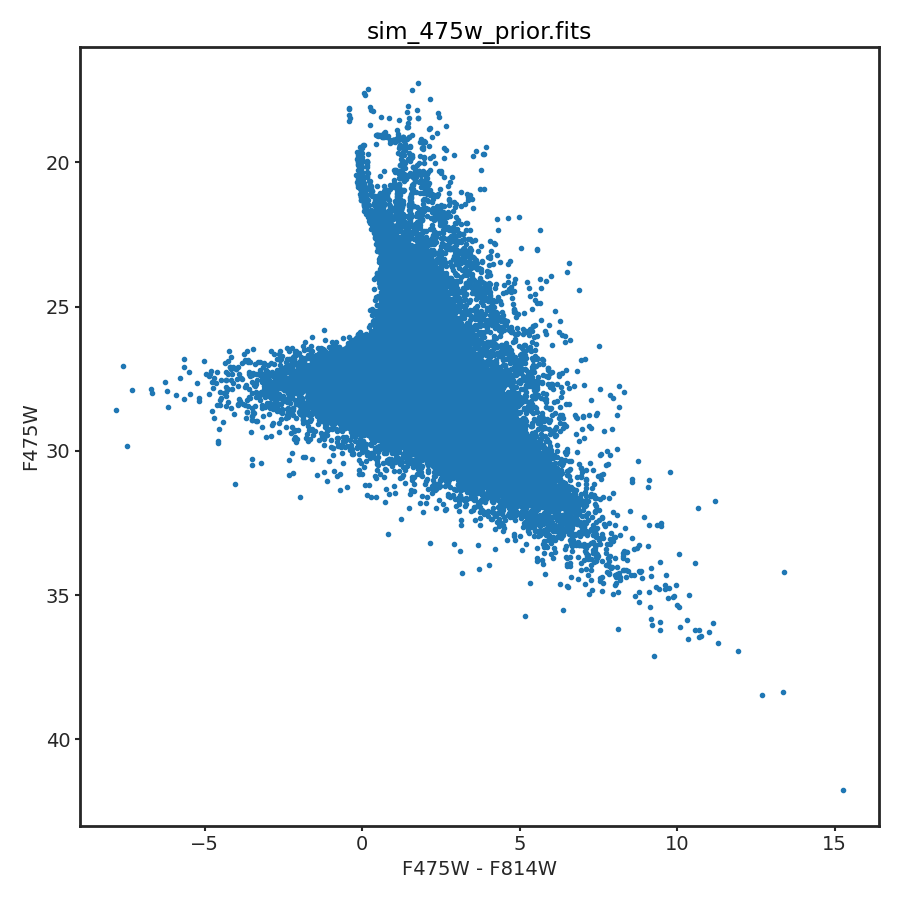
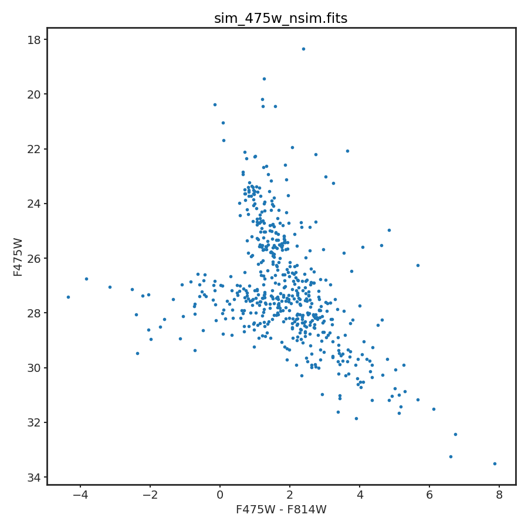

###########
Simulations
###########

Simulations of observations can be made based on already computed  physics and
observation model grids.  Uses for such simulations include testing the
sensitivity of a specific set of observations to BEAST model parameters and
testing ensemble fitters like the MegaBEAST.

Simulations are done using the
`beast.observationmodel.observations.gen_SimObs_from_sedgrid` function. The
script `tools/simulate_obs.py` provides a command line interface and can be run
using the `beast simulate_obs` command once the beast has been installed.
Simulations require already created BEAST physics and observation model grids.
The physics model grid includes the ensemble parameters as these are the same as
the BEAST :ref:`beast_priors`. If a different ensemble model is needed (e.g.,
with a different SFH), then a new physics model (and possible observations
model) will be needed. The module uses already created BEAST physics and
observation model grids by sampling the full nD prior function that is part of
the physics model grid.  The observation model grid provides the information on
the flux uncertainties and biases as well as the completeness.

The number of observations to simulate is either calculated from the age and
mass prior/ensemble models or can be explicitly specified by using the `nsim`
parameter.

If the `beastinfo` ASDF file is passed to the `simulate_obs` script, then the
number of stars is computed based on the age/mass models.  This is done by
computing the mass formed for each unique age in the physics grid  (combination
of age and mass priors) accounting for stars that have already disappeared and
dividing by the average mass (mass prior model).  This number of stars is
simulated at each age and then the completeness function is applied to remove
all the simulated stars that would not be observed.

The `beast simulate_obs` also can be used to just simulate extra ASTs. This
simulation is replacing generating additional input artifical stars and running
those through a photomtery pipeline. Thus, it is very powerful if you need more
ASTs for generating MATCH-satisfied ASTs in addition to what you already have
from the real ASTs. This means that you can avoid extensive/additional real ASTs
as long as your initial/existing real ASTs properly cover the entire CMD space,
i.e., a combination of BEAST-optimzed ASTs supplemented by MATCH-friendly ASTs
should be enough. This simulation provides the information on the flux uncertainties,
biases, and the completeness for the additionally selected model SEDs.

*********
Toothpick
*********

The files for the physicsgrid and obsgrid files are required inputs to
the script.  The output filename is also required.  Note that the extension
of this file will determine the type of file output (e.g. filebase.fits for
a FITS file).
The filter to use for the completeness function is given by the
`--compl_filter` parameter (default=F475W).
Set `compl_filter=max` to use the max completeness value across all the filters.
The SEDs are picked weighted by the product of the grid+prior weights
and the completeness from the noisemodel.  The grid+prior weights can be replaced
with either grid, prior, or uniform weights by explicitly setting the `--weight_to_use`
parameter. With the uniform weight, the SEDs are randomly selected from the given
physicsgrid, and this option is only valid when `nsim` is explicitly set and useful
for simulating ASTs. 

.. code-block:: console

   $ beast simulate_obs physicsgrid obsgrid outfile --nsim 200 --compl_filter=F475W

There are two optional keyword argments specific to the AST simulations: `--complcut`
and `--magcut`. `--complcut` allows you to exclude model SEDs below the supplied
completeness cut in the `--compl_filter`. Note that the brightest models will be exlcuded
as well because of the rapid drop in completeness at the bright end. `--magcut` allows
you to exclude model SEDs fainter than the supplied magnitude in the `--compl_filter`.

.. code-block:: console

   $ beast simulate_obs physicsgrid obsgrid outfile --nsim 100000 --compl_filter=F475W \
                        --magcut 30 --weight_to_use uniform

The output file gives the simulated data in the observed data columns
identified in the physicsgrid file along with all the model parameters
from the physicsgrid file.  The simulated observations in each band are given
as `band_flux` in physical units (ergs cm^-2 s^-1 A^-1),
`band_rate` as normalized Vega fluxes (`band_flux`/vega_flux to match how
the observed data are given), and `band_vega` as vega magnitudes with zero and
negative fluxes given as -99.999.
The physicsgrid values without noise/bias are given as `band_input_flux`,
`band_input_rate`, and `band_input_vega`.

Examples
--------

Example for the `metal_small` example for a simulation based on the prior model.
Plot created with `beast plot_cmd`.  Prior model has a flat star formation history
with a SFR=1e-5 M_sun/year and a Kroupa IMF.

.. code-block:: console

   $ beast simulate_obs beast_metal_small_seds.grid.hd5 \
                        beast_metal_small_noisemodel.grid.hd5 \
                        sim_475w_prior.fits \
                        --beastinfo_list beast_metal_small_beast_info.asdf

Example for the `metal_small` example for a simulation based on input number of
stars.  Plot created with `beast plot_cmd`.  Note that not all 1000 simulated
sources are shown as the simulated sources include those with negative fluxes
that cannot be plotted on a standard CMD.

.. code-block:: console

   $ beast simulate_obs beast_metal_small_seds.grid.hd5 \
                        beast_metal_small_noisemodel.grid.hd5 \
                        sim_475w_nsim.fits \
                        --nsim=1000

High-mass star biased simulations
---------------------------------

When creating simulated observations, using the standard IMF mass prior will
skew your catalog to lower-mass stars.  If you wish to have similar weights for
stars of all masses, use a flat IMF and a log-flat age prior.  To do this,
set the mass prior to `{'name': 'flat'}` and the age prior to
`{'name': 'flat_log'}` in `beast_settings.txt` before creating the model grid.

*********
Truncheon
*********

The code does not handle the truncheon model at this point.  While this model
is doable in the BEAST, it has not been done yet due to several potentially
complex modeling questions for actually using it that might impact how the model
is implemented.

********
Plotting
********

To plot a color-magnitude diagram of the simulated observations, a
sample call from the command line may be:

.. code-block:: console

   $ beast plot_cmd outfile.fits --mag1 F475W --mag2 F814W --mag3 F475W

where `outfile.fits` may be the output from `simulate_obs`.
`mag1`-`mag2` is the color, and `mag3` the magnitude.  If you would like to save
(rather than simply display) the figure, include ``--savefig png`` (or another
preferred file extension), and the figure will be saved as `outfile_plot.png` in
the directory of `outfile.fits`.

**************
Remove Filters
**************

One use case for simulations is to test the impact of specific filters
on the BEAST results.  One solution is to create multiple physics/observation
model grids, create simulations from each set of grids, and then fit the
simulations with the BEAST.  A quicker way to do this is to create the
physics/observation grid set with the full set of desired filters, create
the desired simulations, remove filters from the model and simulations as
needed, and then fit with the BEAST.  This has the benefit of the simulations
with different filter sets are exactly the same except for the removed filters.

As an example, to remove the filters F275W and F336W from the simulated
observations contained in 'catfile.fits' and the 'physgrid.hd5'/'obsgrid.hd5'
set of models use the following command.

.. code-block:: console

   $ python remove_filters.py catfile.fits --physgrid physgrid.hd5 \
        --obsgrid obsgrid.hd5 --outbase outbase --rm_filters F275W F336W

New physics/observation model grids and simulated observation files are
created as 'outbase_seds.grid.hd5', 'outbase_noisemodel.grid.hd5', and
'outbase_cat.fits'.
